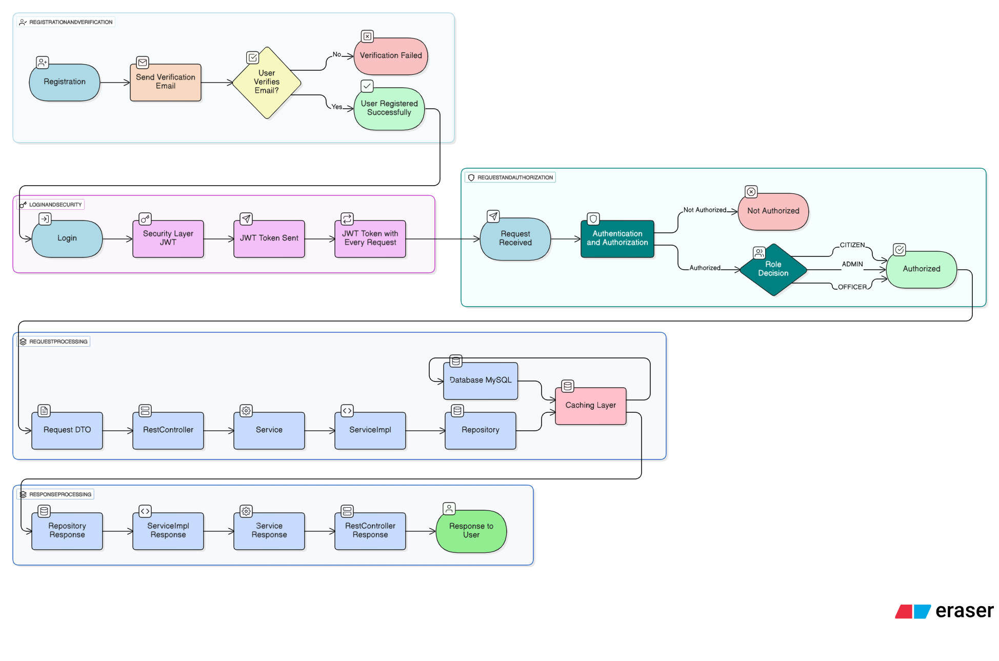
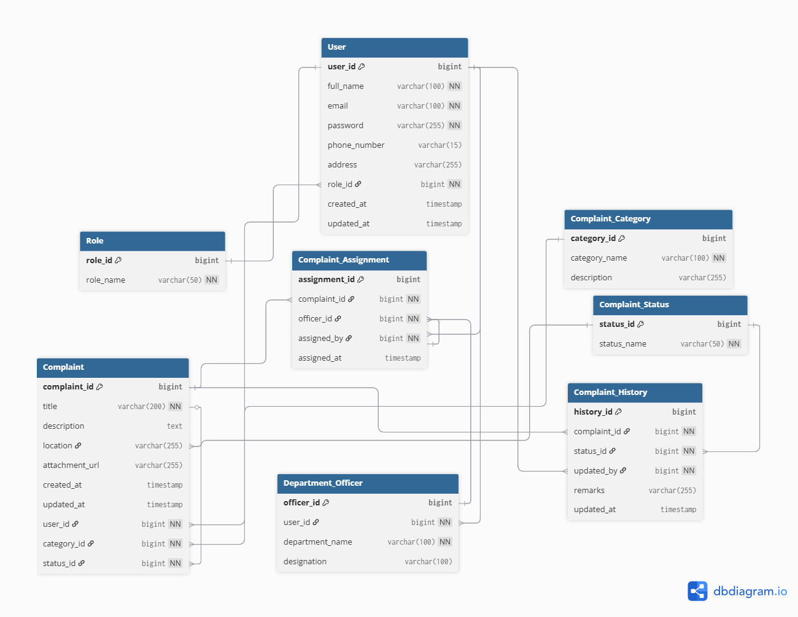

# 🏛️ Smart Grievance System  

A **Spring Boot based Complaint Management System** designed to streamline the process of lodging, tracking, and resolving grievances for citizens.  
The system uses **JWT-based Authentication & Authorization** with role-based access for **Citizen, Admin, and Department Officer**.  

---

## 📌 Features  

### 👩‍💼 Citizen  
- Register/Login using JWT Authentication  
- View & Update Profile  
- File new complaints with title, description, location & attachments  
- Track complaint status (Pending → In Progress → Resolved → Closed)  
- View complaint history & updates  
- Edit or delete their own complaints (before resolution)  

### 🛠 Admin  
- Manage users (citizens, officers, admins)  
- Manage complaint categories & statuses  
- View and moderate all complaints in the system  
- Assign complaints to department officers  
- View complaint history and generate reports   

### 👨‍💼 Department Officer  
- View assigned complaints  
- Update complaint statuses with remarks  
- Maintain complaint history (auto-tracked)  

---

## 🏗️ System Architecture  

- **Spring Boot (REST APIs)** — Backend framework  
- **Spring Security + JWT** — Authentication & Authorization  
- **Spring Data JPA (Hibernate)** — ORM & database interaction  
- **MySQL** — Relational Database  
- **Lombok** — Reduce boilerplate code  



---

## 🗄️ Database Design  

### Tables & Relationships  

- **User (Citizen/Admin/Officer)** → linked with **Role**  
- **Complaint** → filed by Citizen, belongs to Category & Status  
- **Complaint_Category** → e.g., Water, Electricity, Roads, etc.  
- **Complaint_Status** → Pending, In Progress, Resolved, Closed  
- **Department_Officer** → User with officer role, linked to department  
- **Complaint_Assignment** → Links complaint with officer & assigned_by (Admin)  
- **Complaint_History** → Tracks complaint status updates  



---

## 🚀 API Endpoints  

### 🔑 Auth (JWT)  
- `POST /api/auth/register` → Register new user (default: Citizen)  
- `POST /api/auth/login` → Login & get JWT token  
- `GET /api/auth/profile` → Get logged-in user profile  

### 👩‍💼 User (Admin only)  
- `GET /api/users` → Get all users  
- `GET /api/users/{id}` → Get user by ID  
- `POST /api/users` → Create new user  
- `PUT /api/users/{id}` → Update user  
- `DELETE /api/users/{id}` → Delete user  

### 📂 Complaint Categories (Admin only)  
- `GET /api/categories` → Get all categories  
- `POST /api/categories` → Add new category  
- `PUT /api/categories/{id}` → Update category  
- `DELETE /api/categories/{id}` → Delete category  

### 📌 Complaints  
- `POST /api/complaints` → File new complaint (Citizen)  
- `GET /api/complaints/my` → Get logged-in citizen’s complaints  
- `GET /api/complaints/{id}` → Get complaint details  
- `GET /api/complaints` → Get all complaints (Admin only)  
- `PUT /api/complaints/{id}` → Update complaint  
- `DELETE /api/complaints/{id}` → Delete complaint (Admin)  

### 👨‍💼 Officers (Admin only)  
- `POST /api/officers` → Create officer (linked to user)  
- `GET /api/officers` → Get all officers  
- `GET /api/officers/{id}` → Get officer by ID  
- `PUT /api/officers/{id}` → Update officer details  
- `DELETE /api/officers/{id}` → Remove officer  

### 📋 Complaint Assignment (Admin only)  
- `POST /api/assignments` → Assign complaint to officer  
- `GET /api/assignments/officer/{officerId}` → Get officer’s assigned complaints  
- `GET /api/assignments/complaint/{complaintId}` → Get complaint assignment history  

### 🕒 Complaint History  
- `GET /api/history/complaint/{id}` → Get complaint’s full status history  

---

## 🔐 Authentication & Authorization  

- **JWT Token** generated at login  
- Token required for accessing secured endpoints  
- **Role-based Authorization:**  
  - **Citizen** → Manage own complaints  
  - **Admin** → Full system access  
  - **Officer** → Only assigned complaints  

---

## 🛠️ Installation & Setup  

```bash
# Clone repo
git clone https://github.com/hlavania05/smart-grievance-system.git
cd smart-grievance-system

# Configure DB in application.properties
spring.datasource.url={DB_URL}
spring.datasource.username={DB_USERNAME}
spring.datasource.password={DB_PASSWORD}

# Run Spring Boot app
mvn spring-boot:run
